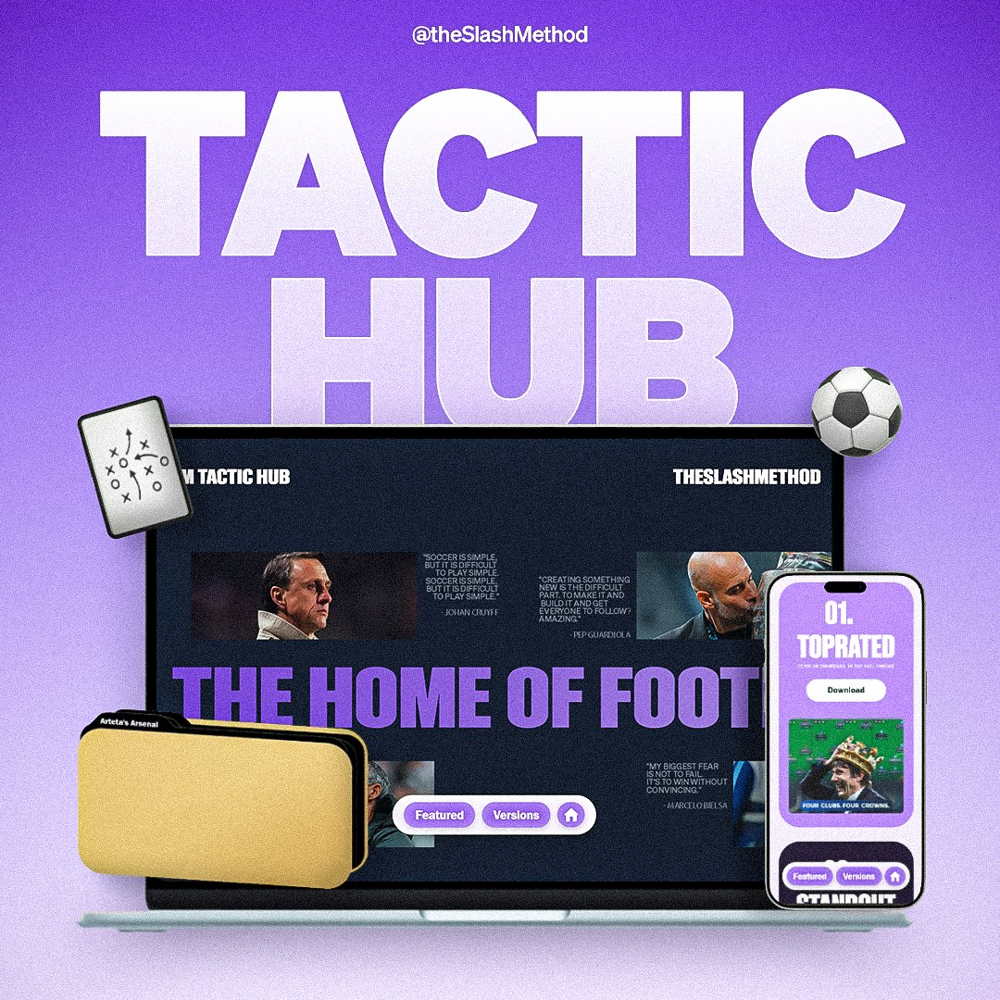

# FM Tactic Hub

> The ultimate home for Football Manager tactics, featuring analysis, downloads and recreations.



**FM Tactic Hub** is a responsive, interactive website designed to showcase and distribute custom tactics for Football Manager. It serves as a central portfolio for tactical deep dives, offering direct downloads and links to detailed analysis threads.

## 🌟 Key Features

* **Immersive Hero Section:** A unique, horizontally scrolling hero section driven by GSAP ScrollTrigger for a dynamic first impression.
* **3D Tactic Slider:** A custom-built, interactive 3D card stack that lets users browse tactics for different game versions (FM24 vs. FM26).
* **Responsive Design:** Fully optimized for both desktop and mobile, with specific touch interactions (swipe support) for mobile users.
* **Direct Integration:** streamlined access to Google Drive downloads and Twitter/X analysis threads.
* **Smooth Animations:** extensive use of GSAP for high-performance animations and transitions.

## 🛠️ Tech Stack

* **Frontend:** HTML5, CSS3, JavaScript (Vanilla)
* **Libraries:** [GSAP (GreenSock Animation Platform)](https://gsap.com/) + ScrollTrigger plugin
* **Fonts:** Sohne Breit, Franklin Gothic Medium

## 📂 Project Structure

```text
├── index.html       # Main structure and content
├── styles.css       # Custom styling, fonts, and responsive layouts
├── script.js        # GSAP animations, slider logic, and interaction handlers
└── Assets/          # Images and Font files
    ├── Images/      # UI elements (covers, plastic cases, backgrounds)
    └── Fonts/       # Local font files